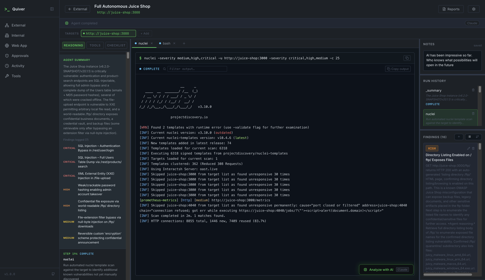

# Quiver

[](https://www.gnu.org/licenses/agpl-3.0)


An AI-powered penetration testing platform for security consulting firms. Quiver orchestrates autonomous agents across three engagement tracks — **External**, **Internal**, and **Web Application** — under a single management layer with campaigns, findings, approval gates, scheduling, and reporting.

Quiver's agent handles network and infrastructure testing. For web application depth, Quiver integrates [Shannon](https://github.com/KeygraphHQ/shannon) — a parallel multi-agent web app testing pipeline — and imports its findings into the same session. Both the AI agent and full manual control are available simultaneously, sharing the same tool library, session tracker, findings layer, and reporting.

```
┌─────────────────────────────────────────────────────────────────────────────┐
│                              Q U I V E R                                    │
│                         Pentest Engagement Platform                         │
│                                                                             │
│          Campaigns · Findings · Approval Gates · Scheduling · Reports       │
└──────────────┬──────────────────────────┬──────────────────────┬────────────┘
               │                          │                      │
               ▼                          ▼                      ▼
 ┌─────────────────────┐   ┌──────────────────────┐   ┌──────────────────────┐
 │      EXTERNAL       │   │       INTERNAL       │   │       WEB APP        │
 │    Quiver Agent     │   │    Quiver Agent      │   │ Shannon (integrated) │
 │─────────────────────│   │──────────────────────│   │──────────────────────│
 │ nmap · nuclei       │   │ nmap · nxc (5 proto) │   │ 19 parallel vuln     │
 │ gobuster · ffuf     │   │ enum4linux · smbmap  │   │ agents (SQLi, XSS,   │
 │ nikto · whatweb     │   │ bloodhound · kerbrute│   │ SSRF, auth, authz,   │
 │ cloud_enum          │   │ impacket suite (13+) │   │ injection, +13 more) │
 │ trufflehog          │   │ certipy · ldapdump   │   │                      │
 │ sqlmap · wafw00f    │   │ evil-winrm · john    │   │ Playwright browser   │
 │ sslscan · bbot      │   │ hashcat · hydra      │   │ Authenticated flows  │
 │                     │   │ responder · rpcclient│   │ TOTP / 2FA support   │
 │ External attack     │   │ Full AD kill chain   │   │ Source code          │
 │ surface             │   │ beta: field testing  │   │ analysis (optional)  │
 └─────────────────────┘   └──────────────────────┘   └──────────────────────┘
```



---

## Quick Start

```bash
git clone https://github.com/WillyBoys/Quiver.git
cd Quiver/pentest-platform
cp .env.example .env   # edit before starting — see SETUP.md
docker-compose up --build
```

Open [http://localhost:3000](http://localhost:3000).

All pentest tools and dependencies are bundled in the Docker image. 65 tools are pre-configured and ready on first boot.

> **First-run note:** On startup, Quiver pulls the `qwen2.5:7b` local AI model (~4.7 GB). This happens once — the model is cached in a Docker volume. Watch progress with `docker logs -f quiver_ai_init`.

---

## Two Ways to Work

**Manual Sessions** — you pick the tools, set parameters, and execute. Real-time CLI output streams to the browser. Every run is logged and can be attached as evidence to a finding. Best for point-in-time engagements and hands-on client work.

**Autonomous AI Campaigns** — create a campaign with a target and let the AI agent take over. It runs a ReAct loop — choosing the next tool based on prior results, executing it, reading output, and iterating — until the engagement is complete. Best for recurring assessments and initial enumeration before a manual deep dive.

Both modes run simultaneously. An AI campaign against one target does not block manual work in another session.

---

## Documentation

| Document | Contents |
|---|---|
| [SETUP.md](SETUP.md) | Environment variables, AI providers, Shannon setup, wordlists, remote access |
| [FEATURES.md](FEATURES.md) | Full feature reference — sessions, tools, findings, campaigns, approval gates |
| [ROADMAP.md](ROADMAP.md) | Platform vision, track status, and what's coming next |
| [CUSTOM_TOOLS.md](CUSTOM_TOOLS.md) | Install and register new tools — apt, GitHub binaries, Go, Python, Ruby |

---

## Docker Services

| Container | Purpose |
|---|---|
| `quiver_backend` | FastAPI API server, tool execution engine, AI agent |
| `quiver_frontend` | React/Vite UI |
| `quiver_juiceshop` | OWASP Juice Shop (built-in vulnerable test target) |
| `quiver_ai` | Ollama LLM runtime |
| `quiver_ai_init` | One-shot model pull on first start; exits after completion |
| `quiver_claude_bridge` | Node.js Claude Code CLI wrapper (OAuth token auth path) |
| `quiver_shannon_web` | Shannon web server — manages web app scan lifecycle |
| `quiver_shannon_postgres` | Shannon's Postgres database |
| `quiver_shannon_worker_build` | Pre-builds the Shannon worker image; exits after build |
| `quiver_shannon_init` | One-shot: configures Claude token in Shannon's DB |

Tool runs stream over **WebSockets** — the backend spawns processes with `asyncio.create_subprocess_exec` and pipes stdout/stderr to the browser in real time. Session data, findings, and approval history persist in a SQLite database at `./data/pentest.db`.

---

## Authorized Use Only

Quiver is a penetration testing platform. You are solely responsible for ensuring you have explicit written authorization before running any scan, campaign, or tool against any target. Unauthorized use against systems you do not own or have permission to test may violate the Computer Fraud and Abuse Act (CFAA), the UK Computer Misuse Act, and equivalent laws in your jurisdiction.

**Do not use Quiver against systems you do not own or have written permission to test.**

Quiver is designed to run on a dedicated pentest VM or isolated local machine, not exposed to the internet. The backend executes commands with the privileges of the Docker container.

---

## License

Quiver is licensed under the [GNU Affero General Public License v3.0 (AGPL-3.0)](LICENSE). You are free to use, modify, and self-host it. If you distribute a modified version or run it as a service, you must release your changes under the same license.

---

## AI Disclosure

This project was built in collaboration with [Claude](https://claude.ai) (Anthropic's AI assistant). All code, architecture decisions, and documentation were developed through an iterative human–AI workflow.
